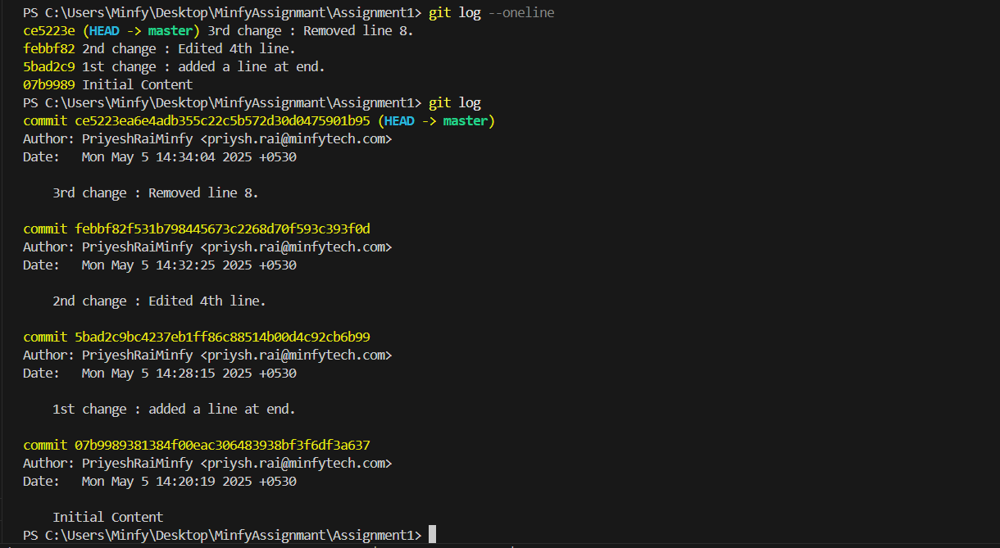

Assignment 1: Basic Git Workflow

Objective
Learn fundamental Git commands and the basic workflow.

Files
`folder.txt` – contains 9-10 lines of sample text

Commit History
1. Initial Commit
Added the text file with initial content.

2. 1st commit:
Added a new line.

3. 2nd commit:
Eddited a spelling error.

4. 3rd commit:
Removing an extra line in the file.

These files are not working and i am unable to resolve it.

## Git Log Screenshot
 

## Git Diff    
Used git command to compare changes between commits. Examples:
git diff HEAD~1 HEAD

## Assignment 2
GitHub Basics & Collaboration

Objective:
Learn how to use GitHub for collaboration, including pushing code, branching, and creating pull requests.

Tasks Completed:
1. Created README.md on GitHub.
2. Pulled changes to my local repo using git pull origin main.
3. Created a new branch 'feature/update-readme' for updates.
4. Updated README.md with details of Assignment 1 and pushed changes.
5. Created a pull request from 'feature/update-readme' to 'main'.
6. Merged the pull request into the 'main' branch on GitHub.

 
 